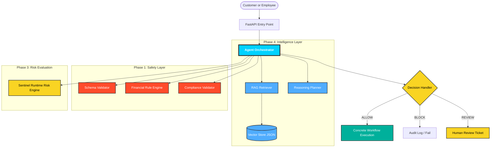
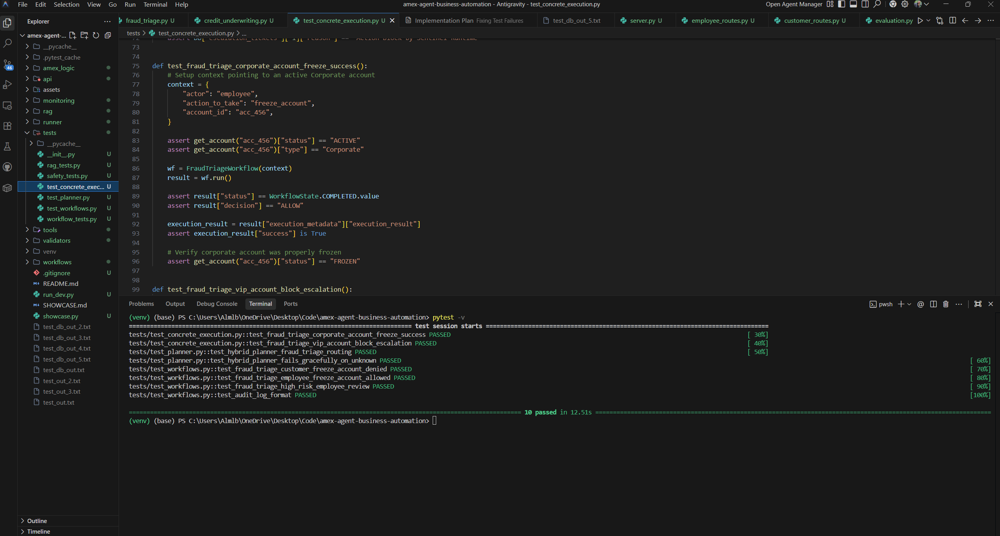

# secure-financial-ai-agent
"The Secure Financial AI Agent is a robust, policy-driven AI runtime inspired by enterprise financial systems like American Express. It integrates with the Sentinel risk engine to evaluate and govern agent actions (like account freezes) using RAG-retrieved policies. It features deterministic workflows and safety validators to ensure safe, context-aware execution of financial automations."

# Secure Financial AI Agent 🚀

## 📌 Executive Summary
The **Secure Financial AI Agent** is a policy-driven AI runtime designed to automate highly critical, volume-heavy operational processes like fraud triage and credit underwriting. 

By integrating deterministic workflows with LLM decision-making, policy retrieval (RAG), and a strict safety validator (Sentinel), this system acts as a **Level 1 autonomous agent** capable of making rapid, compliant decisions at scale.

### 💰 The Business Problem (The "Million Dollar Problem")
Financial institutions face massive operational costs associated with manual review processes. 
- **High Volume & Slow Response:** Human analysts take minutes to hours to review suspicious transactions or credit requests, leading to increased fraud losses and poor customer experiences.
- **Operational Overhead:** Maintaining large teams of L1 support and compliance officers is expensive.
- **Inconsistent Decisioning:** Human analysts can misinterpret complex, evolving financial rules, leading to costly compliance fines.

### 💡 The Solution & ROI
This AI agent mitigates these problems by bringing the cost-per-decision down to near-zero while enforcing 100% compliance with internal policies.
1. **Automated Fraud Triage:** Instantly processes transaction anomalies. High-risk intents trigger immediate account freezes (preventing losses), while ambiguous cases are intelligently escalated.
2. **Speed to Action:** Reduces time-to-resolution from days/hours down to milliseconds.
3. **Guaranteed Safety:** The integration with the **Sentinel Runtime Risk Engine** guarantees that the AI cannot hallucinate its way into executing unauthorized, high-risk actions. If an action breaches risk thresholds, it is automatically blocked or escalated to a human.

**Estimated Business Impact:** Translates to potentially **millions of dollars saved annually** through combined fraud loss prevention and a drastic reduction in manual operational overhead.

---

## 🏗️ Architecture & Core Components

1. **Stateful Workflows (`workflows/`)**: Deterministic state machines (e.g., `FraudTriageWorkflow`) that guide the LLM through a strict sequence: Intent Validation -> Context Retrieval -> Risk Evaluation -> Execution.
2. **Policy Retrieval (RAG) (`rag/`)**: Dynamically loads real-time compliance policies and rules to inform the agent's context.
3. **Sentinel Risk Engine (`runner/sentinel_client.py`)**: A dedicated safety layer that scores the risk of the agent's intended action (e.g., `freeze_account`) and issues hard `ALLOW`, `REVIEW`, or `BLOCK` verdicts.
4. **Concrete Tools (`tools/`)**: The actual atomic functions the agent uses to interact with the system (e.g., `mock_db`, `credit_tools`, `escalation_tools`).
5. **Validators (`validator/`)**: Pre-execution checks that ensure data structures and inputs meet strict financial rules and compliance schemas before any tool is triggered.

---

## 🚀 Getting Started

### Prerequisites
- Python 3.10+
- An OpenAI API Key (or equivalent LLM provider, depending on configuration)

### 🖼️ Visual Demonstration

### 🎥 Live Video Demonstration
Check out the full walkthrough of the Financial AI Agent in action: 
**[Watch the Live Demo Recording](https://1drv.ms/v/c/656ad0e98a3b6fab/IQBEezzZOPX3RIW8fCLyI_wwAQKfjAcJW7n5AtJCiLczB94?e=8kBjLY)**

To see the agent in action via text logs, we have also provided a [Detailed Showcase](SHOWCASE.md). Below are the "Money Shots" of our safe automation system:

### 1. The Autonomous Orchestrator (Authorized Action)

### 2. Guardrails in Action (Unauthorized Attempt Blocked)
Deterministic validators intercept unauthorized actions before they reach the core logic.

### 3. Risk Intelligence (Automated Escalation)
The Sentinel Risk Engine detects threshold violations and triggers human review.

### 4. 100% Safety Compliance (Verification Suite)
Validating the "Trust but Verify" model with our automated test suite.

### 5. Policy Intelligence (RAG Ingestion)
Demonstrating how the agent "learns" relevant financial policies by ingesting markdown documents into a high-speed vector store.

---

---

## 🏛️ Proprietary Architecture Notice
The source code for this repository is part of a proprietary internal system and is currently vaulted to protect Intellectual Property (IP). This repository serves as a **Documentation & Architecture Showcase** to demonstrate the high-level logic, security governance, and multi-layered safety of the agentic workforce. 

For inquiries regarding the technical implementation, underlying logic, or professional security consulting, please contact the repository owner.

---

## 🛡️ Security & Compliance First
This project isn't just an LLM wrapper; it's a **business-first AI deployment** built around the principles of deterministic safety. The LLM acts as the *reasoning engine*, but the system's *actions* are rigidly bounded by code, eliminating the risk of catastrophic AI malfunctions in a production financial environment.
