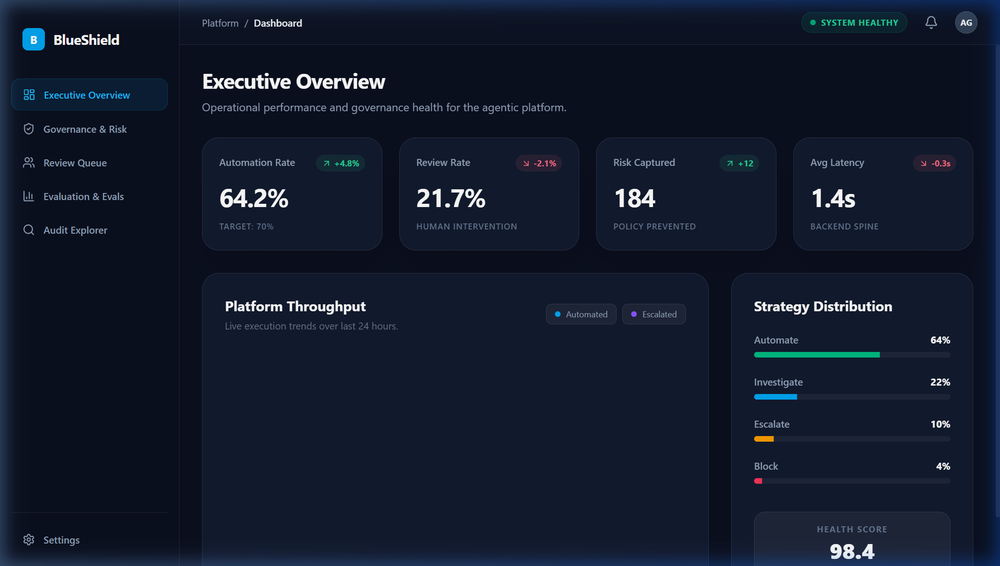
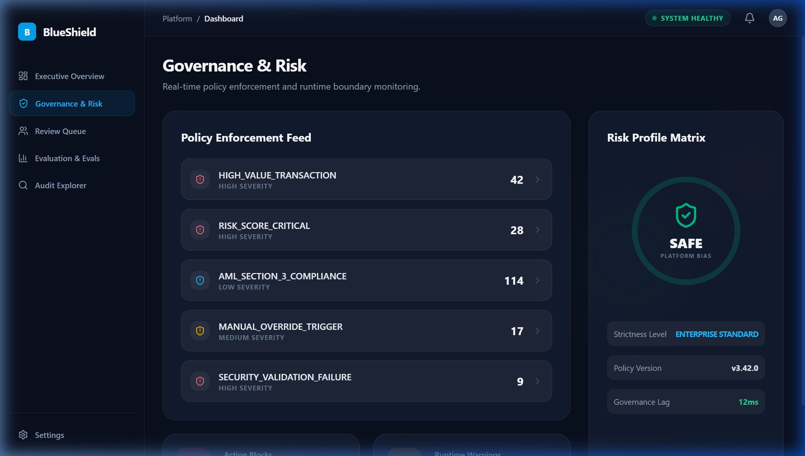
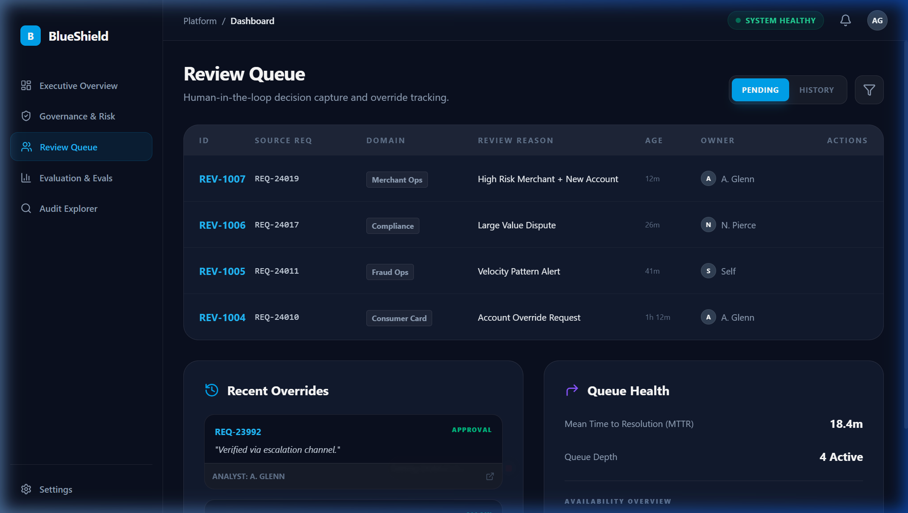
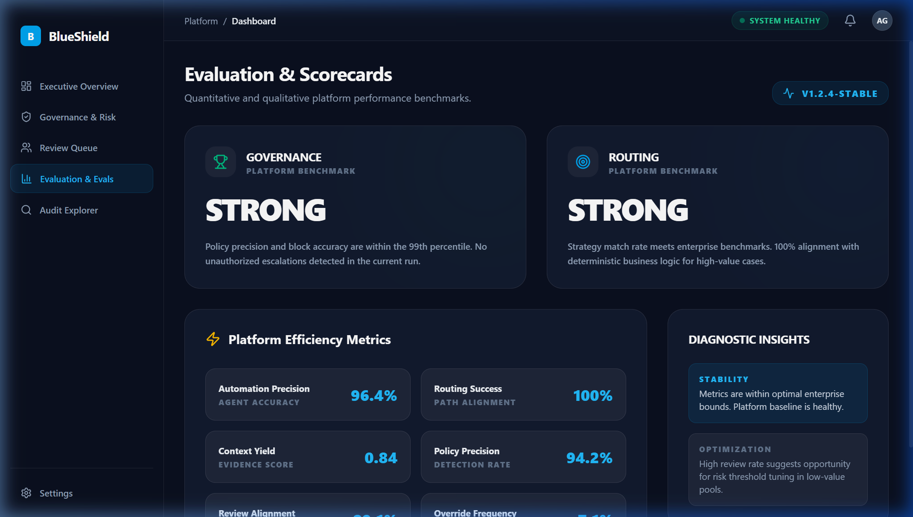

# Governed Agentic AI Platform for Financial Workflow Automation

## Overview

This project is a production-oriented agentic AI platform designed to automate financial workflow decisioning with strong governance, human oversight, and operational visibility. Rather than acting as a simple AI assistant, the platform separates intake, context enrichment, deterministic control-plane decisions, strategy routing, bounded agent execution, runtime guardrails, human review, audit logging, evaluation, and dashboard visibility into clear architectural layers.

---

## Problem Statement

Financial workflows often suffer from manual bottlenecks, inconsistent escalation decisions, low auditability, weak review controls, and limited visibility into where automation is safe. Basic AI agents may generate useful output, but without deterministic controls, runtime safeguards, and review workflows, they are difficult to trust in regulated environments.

This platform addresses that gap by treating AI as a governed decision system rather than a standalone model workflow.

---

## Pain Points Solved

This platform addresses several common problems in regulated financial AI workflows:

- Manual review bottlenecks that slow operational throughput
- Inconsistent routing and escalation decisions across analysts or workflows
- Unsafe AI automation without deterministic governance boundaries
- Poor visibility into why a case was automated, reviewed, escalated, or blocked
- Weak traceability for audit, compliance, and post-incident analysis
- Limited human oversight for high-risk or customer-impacting decisions
- Low operational visibility into queue depth, review backlog, policy activity, and runtime outcomes
- Lack of measurable evaluation signals to improve governance and automation quality over time

---

## Business Value

This platform is designed to create measurable business and operational value by:

- Safely automating lower-risk work to reduce manual effort
- Escalating higher-risk cases earlier through deterministic controls
- Improving consistency of routing and policy-driven decisions
- Strengthening review quality with structured packets and evidence-backed recommendations
- Improving auditability through end-to-end trace logging
- Increasing operator visibility through dashboards and scorecards
- Supporting more responsible AI adoption in regulated enterprise workflows

---

## Architecture Philosophy

This project is designed as a governed AI decision platform rather than a standalone AI app.

The architecture separates:
- **Intake** — standardized request normalization
- **Context & Retrieval** — evidence assembly and enrichment
- **Control Plane** — deterministic validation, risk scoring, and policy mapping
- **Strategy Routing** — rules-based path selection
- **Bounded Agent Execution** — AI agents with scoped responsibilities
- **Runtime Governance** — step limits, budgets, retry controls
- **Human Review** — structured oversight for elevated-risk cases
- **Audit & Evaluation** — immutable trace and quality scorecards
- **Dashboard Visibility** — real-time operational console

This separation allows the platform to balance safe autonomy, explainability, scalability, and human oversight.

---

## Architecture Diagram

```
[Inbound Event / API Request]
            │
            ▼
      ┌─────────────┐
      │ Intake Layer │  ← Normalize request, validate schema
      └──────┬──────┘
             │
             ▼
  ┌──────────────────────┐
  │ Context & Retrieval  │  ← Retrieve policy docs, prior cases, evidence
  └──────────┬───────────┘
             │
             ▼
  ┌──────────────────────────────────┐
  │   Control Plane                  │
  │   Validate → Risk Score → Policy │  ← Deterministic governance
  └──────────────────┬───────────────┘
                     │
                     ▼
            ┌────────────────┐
            │ Strategy Router │  ← Rules-based path selection
            └───┬──────┬──┬──┘
                │      │  │
          ┌─────┘      │  └──────┐
          ▼            ▼         ▼
      [AUTOMATE]   [ESCALATE]  [BLOCK]
          │            │
          ▼            ▼
    [AI Agents]  [Review Queue]
          │            │
          ▼            ▼
  [Runtime Governance] [Human Decision]
          │
          ▼
  [Audit + Evals + Dashboard]
```

---

## Dashboard Screenshots

| Executive Overview | Governance & Risk |
|---|---|
|  |  |
|---|---|
|  |  |

---

## Core Capabilities

| Capability | Description |
|---|---|
| **Governed Intake** | Every request normalized via `PlatformRequest` schema |
| **Context Enrichment** | Policy retrieval, evidence assembly, prior case lookup |
| **Deterministic Control Plane** | Validate → Risk Score → Policy → `ControlPlaneDecision` |
| **Strategy Routing** | Rules-based: `AUTOMATE` / `INVESTIGATE` / `ESCALATE` / `BLOCK` |
| **Bounded Agent Execution** | Multi-agent CrewAI workflows with scoped tool calling |
| **Runtime Guardrails** | Step limits, retry budgets, fallback triggers |
| **Human Review Workflow** | Review packets, queue management, approval/override tracking |
| **Evaluation Scorecards** | Offline evals, quality metrics, diagnostic insights |
| **Event-Driven Pipeline** | Producer → Queue → Consumer → Publisher with lifecycle tracking |
| **Audit Trail** | Immutable trace of every decision, policy hit, and reviewer action |
| **Observability Console** | Datadog-inspired React dashboard with real-time telemetry |

---

## End-to-End Workflow

```
1. An inbound request or event enters the platform
2. Intake normalizes the request into a standard contract
3. Context and retrieval assemble supporting evidence and business context
4. The control plane validates input, scores risk, and maps policy boundaries
5. The strategy router selects the correct governed path
6. Agents perform bounded analysis or execution tasks
7. Runtime guardrails enforce safe execution limits
8. High-risk or sensitive cases are routed to human review
9. Audit traces, evaluation metrics, and dashboard panels are updated
```

---

## Demo Walkthrough

This project solves the problem of unsafe and opaque automation in financial workflows.

I designed it as a governed agentic AI platform rather than a basic AI app. Requests enter through a standardized intake layer, context is assembled through retrieval and enrichment, and the control plane applies deterministic validation, risk scoring, and policy boundaries before any execution happens.

From there, the strategy router selects the appropriate path: automate, review, escalate, or block. Agents then perform bounded tasks inside runtime guardrails. If a case is high-risk, incomplete, or sensitive, it is routed into a human review workflow. Throughout the process, the platform records audit traces, evaluation signals, and operational metrics that feed the dashboard.

The result is a platform that supports safe autonomy, stronger oversight, and clearer operational visibility in a regulated environment.

---

## Platform Quality: Test Results

```
======================== 45 passed in 0.49s ========================

Unit Tests:         24 passed  (Control Plane, Strategy, Event Models)
Integration Tests:   9 passed  (End-to-End, Review Path, Event Pipeline)
Failure Tests:      12 passed  (Malformed Input, Policy Violations, Missing Context)
```

> The failure test suite discovered a real governance gap: the risk engine was auto-approving requests with empty customer context. The fix was deployed immediately — missing context now scores as elevated risk.

---

## Evaluation Scorecard

```
OVERALL PASS RATE: 100% (4/4 scenarios)

METRICS:
  Automation Rate:  25%     Review Rate:     50%
  Block Rate:       25%     Strategy Match:  100%

SCORECARD:
  Governance:      STRONG
  Routing Quality: STRONG
  Efficiency:      FAIR
```

---

## Repository Structure

```text
amex-agent-business-automation/
├── app/
│   ├── api/            API service and telemetry
│   ├── intake/         Request schema and normalization
│   ├── context/        Retrieval and evidence assembly
│   ├── control_plane/  Validation, risk scoring, policy
│   ├── strategy/       Routing logic and path selection
│   ├── agents/         Multi-agent execution layer
│   ├── actions/        Tool calling and transaction service
│   ├── runtime/        Guardrails, retries, budgets
│   ├── review/         Human-in-the-loop review workflow
│   ├── audit/          Immutable trace and explainability
│   ├── evals/          Evaluation scorecards and metrics
│   └── events/         Event-driven pipeline
├── dashboard/          React observability console
├── monitoring/         Event bus and platform metrics
├── docs/               Architecture, workflow, and interview docs
├── tests/              Unit, integration, and failure tests
├── scripts/            Verification and simulation runners
└── infra/              Dockerfiles, deployment docs, env config
```

---

---

## 🏛️ Documentation Index

| Doc | What It Covers |
|---|---|
| [Architecture](docs/architecture.md) | System design philosophy, layers, tradeoffs |
| [Workflow](docs/workflow.md) | All 5 execution paths |
| [Control Plane](docs/control_plane.md) | Governance engine deep dive |
| [Review Workflow](docs/review_workflow.md) | Human oversight design |
| [Event System](docs/events.md) | Async pipeline, lifecycle states, production mapping |
| [Evaluation](docs/evaluation.md) | Quality measurement framework |
| [Testing](docs/testing.md) | Test strategy and failure coverage |
| [Interview Walkthrough](docs/interview_walkthrough.md) | Prepared talk track |
| [Local Deployment](infra/deployment/local.md) | Quick start guide |
| [Production Deployment](infra/deployment/production.md) | Scaling and production mapping |

---

## Infrastructure and Deployment

The platform is structured as three containerized services:

| Service | Technology | Purpose |
|---------|-----------|---------|
| **API** | FastAPI | Intake, control plane, telemetry WebSocket |
| **Worker** | Python Async | Event consumer, governed pipeline execution |
| **Dashboard** | React + Nginx | Operator observability console |

```bash
# Start all services locally
docker compose up --build

# Run verification
python scripts/verify_event_pipeline.py

# Run test suite
python -m pytest tests/ -v
```

---

## Future Enhancements

- Persistent review queue and audit database (PostgreSQL)
- Externalized event broker (Kafka / AWS SQS)
- Deeper real-world retrieval with vector search (LanceDB / Pinecone)
- Richer approval UI for reviewers with role-based access controls
- Production-grade monitoring integrations (OpenTelemetry → Datadog)
- Adaptive policy tuning based on evaluation outcomes
