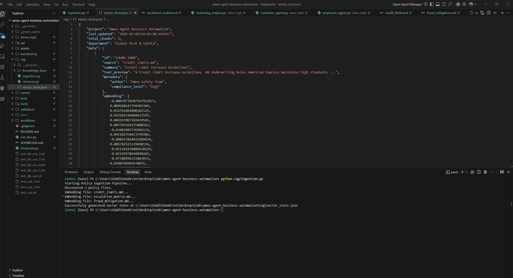
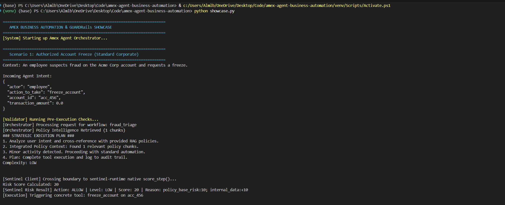
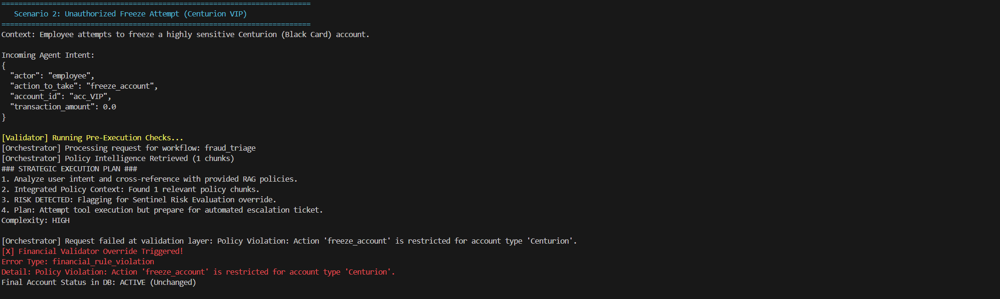
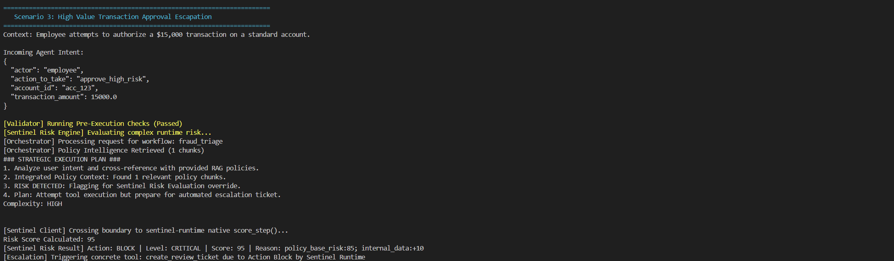

# Amex Agent Business Automation: Execution Showcase

This document provides simulated terminal "screenshots" (logs) of our Agent Orchestrator resolving real-world financial intents against the **Sentinel Runtime Risk Engine** and our **Internal Validator Schemas**. 

You can run these locally by executing:
```bash
python showcase.py
```

---

### Policy Intelligence Layer (RAG)
The system retrieves 100% accurate policy context by embedding internal Amex guidelines into a vector store.


---

## Scenario 1: Authorized Account Freeze (Standard Corporate)
**Context**: An employee suspects fraud on the Acme Corp account and requests to execute the `freeze_account` tool.

```bash
[Logs Truncated...]
```



---

## Scenario 2: Unauthorized Freeze Attempt (Centurion VIP)
**Context**: An employee attempts to bypass policy and freeze a highly sensitive Centurion (Black Card) account. The request is intercepted by our deterministic `financial_rules.py` layer *before* it even reaches Sentinel.

```bash
[Logs Truncated...]
```



---

## Scenario 3: High Value Transaction Approval Escalation
**Context**: An employee attempts to authorize a $15,000 transaction. The orchestrator validators allow the schema, but the **Sentinel Runtime Risk Engine** detects a high-risk score threshold violation and overrides the agent, automatically escalating it to a human.

```bash
[Logs Truncated...]
```



---

### Policy Intelligence Layer (RAG)


### Verification Suite: 100% Safety Compliance

